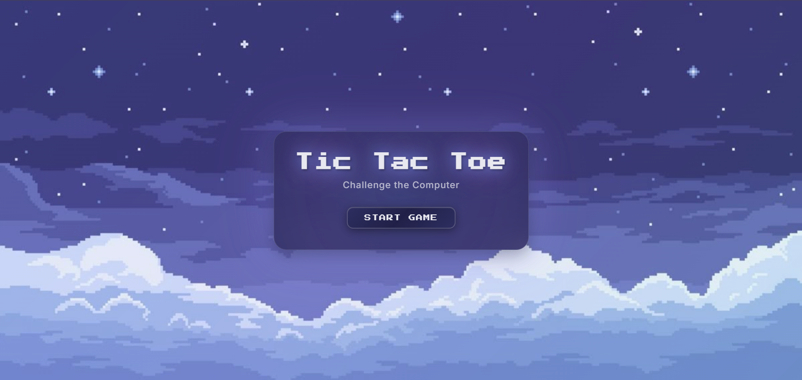
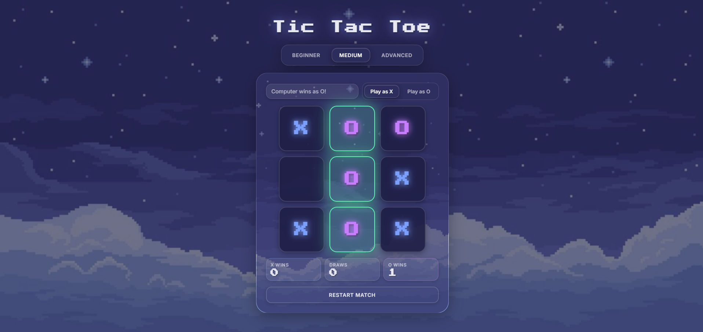

# Tic Tac Toe Game

A web-based Tic Tac Toe game I built using HTML, CSS, and JavaScript. You can play against the computer with three different difficulty levels.

## About This Project

I created this Tic Tac Toe game as a fun project. It has a nice pixel-art style with a night sky background. The computer opponent has three difficulty levels, so you can choose how challenging you want the game to be.

## Features

- Three difficulty levels (Beginner, Medium, Advanced)
- Score tracking for wins, draws, and losses
- Choose to play as X or O
- Pixel-art styled interface
- Visual win highlighting

## Screenshots

### Start Screen

*The welcoming start screen with the game title and "Challenge the Computer" subtitle*

### Gameplay Screen

*The main game interface showing the board, difficulty selection, score tracking, and player options*

## How to Play

Just open `index.html` in your browser. Click "Start Game", choose your difficulty level, pick X or O, and start playing! The computer will make its move automatically after yours.

## AI Difficulty Levels

- **Beginner**: Makes random moves
- **Medium**: Tries to win and blocks your moves
- **Advanced**: Uses smart strategy - very hard to beat!

## Technologies Used

I built this using HTML, CSS, and JavaScript. No frameworks or libraries needed - just pure web technologies.
